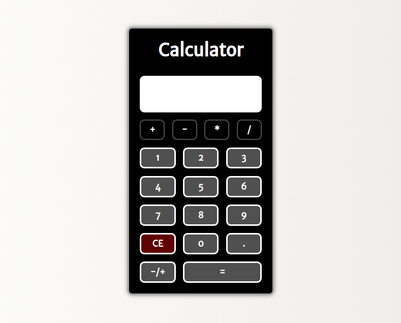

# <a href="https://jseguraweb.github.io/calculator/">Calculator</a>

> HTML-CSS-JS project: create a functional calculator with pure JavaScript

> ## Details:

- It's about practicing. The intended user and the client is going to be me. 
- Goal: include it in my portfolio.

> ## Priorities:

1. Start a Repository on GitHub
2. Create a Wireframe
3. Research. Topic: addEventListener
4. Coding time

    **GOAL: create a calculator that can add, subtract, multiply and divide 2 numbers**

> ## New skills (to research):

- learn to sum and subtract. No, I'm kidding... I already could do it with my fingers.

> ## Achievements + lessons learned:

- get comfortable with the manipulation of the DOM, emphasizing the method addEventListener
